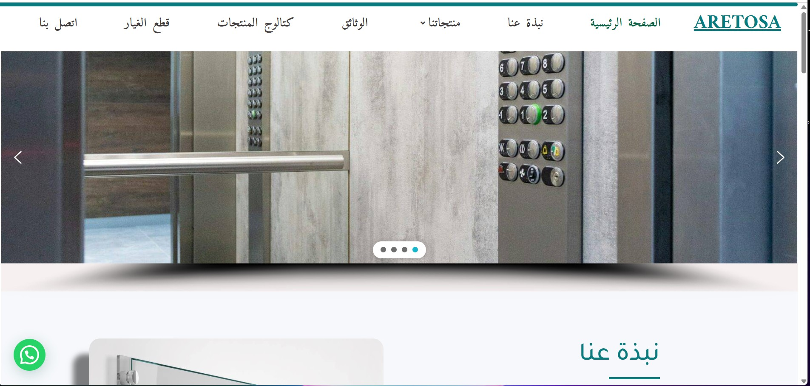
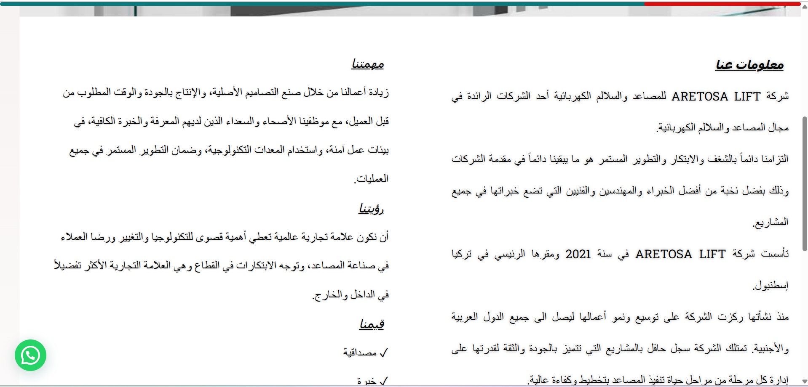
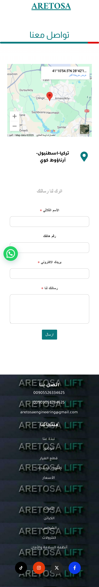

# 🌐 WordPress Showcase

تم تطوير هذا الموقع ضمن فريق يستخدم منهجية Scrum، بهدف تصميم واجهة رقمية لعرض خدمات شركة وهمية باستخدام WordPress.

This project was developed by a team using the Scrum methodology, with the goal of building a digital interface that showcases fictional company services using WordPress.

🔗 [زيارة الموقع – Visit Site](https://aretosa.com)

---

## 👤 دوري في المشروع – My Role

تمثّل دوري كـ Scrum Master في تنسيق العمل بين الفريق وصاحب الموقع. شملت مهامي:

• إدارة الـ Sprints ومتابعة المهام باستخدام Trello  
• تنظيم الاجتماعات اليومية وضمان تقدّم العمل  
• تحسين تجربة المستخدم واقتراح هيكل صفحات واضح  
• التواصل المستمر مع صاحب الموقع لأخذ ملاحظاته وتعديلاته  
• إعادة توجيه تلك الملاحظات للفريق وتنفيذها ضمن الجدول الزمني

As Scrum Master, I coordinated work between the team and the site owner. My responsibilities included:

• Sprint planning and progress tracking using Trello  
• Daily team check-ins and workflow coordination  
• UX improvements and page structure suggestions  
• Ongoing communication with the client for continuous feedback  
• Translating that feedback into team updates and implemented changes

---

## 🛠️ التقنيات – Tech Stack

• WordPress + Elementor  
• HTML / CSS  
• Trello for task management

---

## 🖼️ صور من الموقع – Screenshots

### 💻 Desktop View

  

### 📱 Mobile View

---

## 📎 كيفية التصفح – How to Use

الموقع قابل للتصفح عبر القائمة الرئيسية لجميع الأقسام، ويعمل بشكل سلس على الأجهزة المختلفة.

The site is navigable through the main menu, and is fully responsive across screen sizes.

---

## 📄 License

MIT License  
Developed by Abdulhadi Ibrahim – 2025